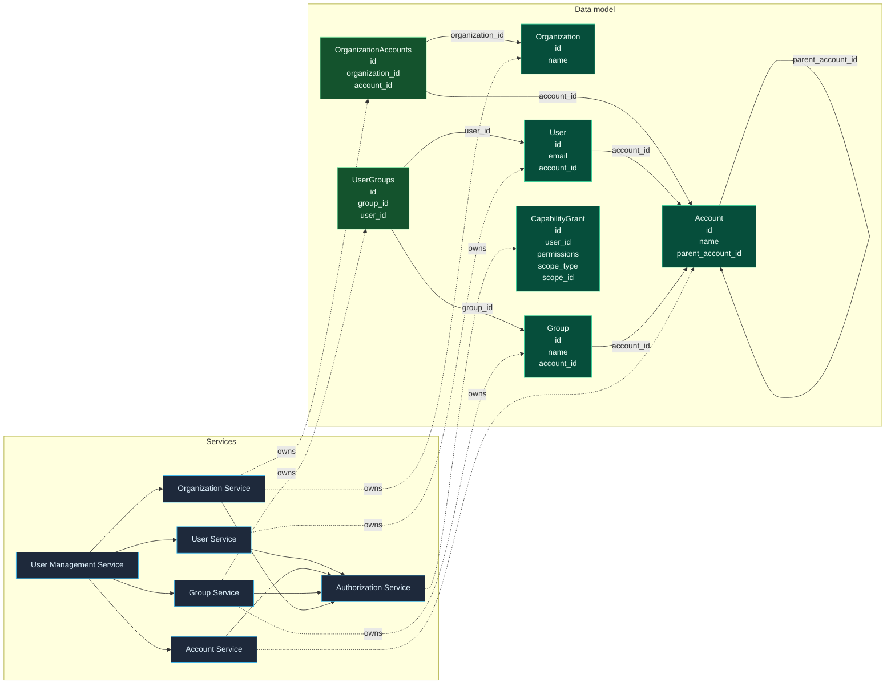
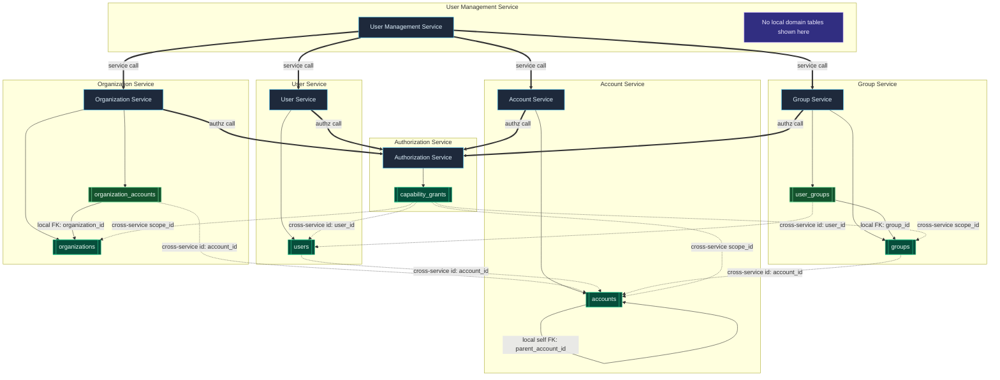
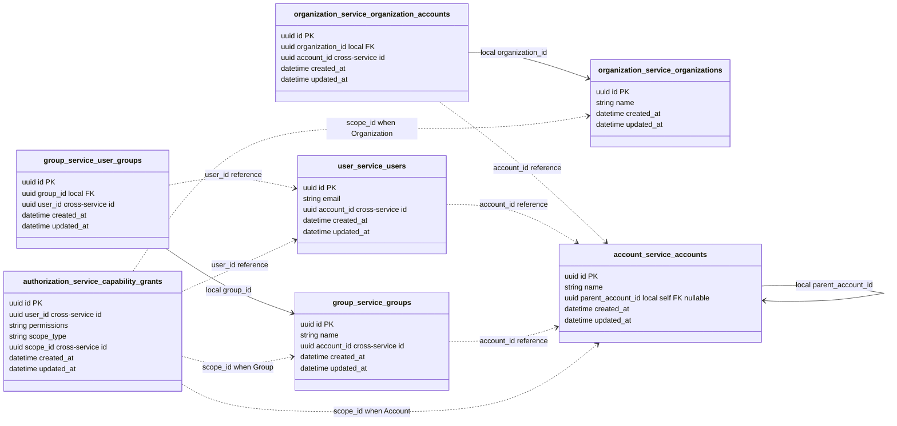

# GraphQL Auth Explosion Case Study: Overview

Series: [GraphQL Auth Explosion Case Study](/articles/series/IAM-System-Demo/iam-system-demo)

> Status: ramblings

LLM Disclaimer:
LLM's were used in the preperation of this series of articles.  For the most part I try to call out per-article if it is particularly LLM heavy, but for the most part I'm trying to keep it human-written and avoid triggering people.

# Timeline overview 

(LLM extracted from git commits)

1. 2025-07-13 to 2025-07-14 - Bootstrapping the service skeleton

Commits: .gitignore, Rails builder Dockerfile, then five Rails services appear: user-service, account-service, authorization-service, organization-service, user-management-service.
Then the repo fills in the shared plumbing: Docker/db package fixes, RSpec installs, OpenTelemetry integration, GraphQL gems, compose wrappers, env files, commands, system config, and the first models/migrations/scripts.
Story: this is the “turn an empty repo into a multi-service Rails system” phase.

2. 2025-07-14 to 2025-07-18 - Make the first end-to-end demo work

Commits like User requires Account, Orgs, Accounts, and Users all create, Generate 100k random users, and Add awesome_print... CTE query.
Then the UI/frontdoor gets wired up, account filtering appears, and the first auth checks go live with User#can().
Story: the project stops being just scaffolding and becomes a working IAM demo with users, accounts, orgs, and authorization behavior.

3. 2025-07-20 to 2025-07-21 - Push into async/event-driven scale

The log switches to SNS/SQS, an eventstream-based user creator, queue workers, and a million-user stress attempt.
One commit explicitly says the million-user run failed because LocalStack blew up, followed by a switch to goaws and brute-force worker fixes.
Story: the demo is now being stress-tested as a distributed system, and the infrastructure limits start showing up.

4. 2025-07-23 to 2025-08-08 - Harden the data model and reduce chatter

README/doc updates land, then the account hierarchy query gets refined, organization filtering and caching appear, grant caching lands, MultiFetchCache is implemented, and the system stops loading users everywhere just to do auth checks.
There’s also a production config fix for SECRET_KEY_BASE.
Story: this looks like the “make it less fragile and less chatty” phase, with a lot of attention on query shape, caching, and operational correctness.

5. 2025-08-13 to 2025-08-21 - Add groups and move the UI onto GraphQL

A new group-service shows up, group creation is wired in, and the user-management UI starts integrating users and groups.
Then the repo moves hard into GraphQL: single-account queries, accountWithParents, group types, organization queries, raw multi-account queries, dataloader refactors, CSRF skipping for GraphQL, and async chunked retrieval.
Story: the app is expanding its IAM model beyond users/accounts/orgs into groups, while the UI/query layer is being rebuilt around batched GraphQL access.

6. 2025-08-28 to 2025-09-02 - Final optimization and cleanup

This is the tuning phase: UUID array bind params, tracer fixes, an attempted “real async” pass, a primary-key correction and revert, POST span reshaping, and finally aggregated counts for accounts, users, and groups.
Story: once the shape of the system is in place, the remaining work is about performance, tracing, and getting the query surfaces into a better final form.

# Meet my Straw Men

This is my distributed authorization system. There may or may not be similarities to authorization systems I have worked with before, details will differ but I wanted to talk about distributed system optimization and this is as good of a reason as any.

We start with Organization, owned by OrganizationService. Organizations have names, and multiple accounts. Organization service knows which Accounts belong to which Organization.

Account service owns Accounts. Accounts have a name. Accounts also have a parent_account_id. An account without a parent_account_id is a top level account for the Organization.

User service owns Users, which belong to an account, have an email and other details, and have CapabiliyGrants and Groups.

Group service owns Groups, and knows which groups belong to which accounts, and which users belong to which groups.

AuthorizationService owns CapabilityGrant, and has a rest API for checking 'can' requests - i.e. can a specific user access a specific object.

We also have UserManagementService, which the user will send web requests to directly. We also eventually support GraphQL on this service.

A tricky bit about this authorization system comes from the account hierarchy as defined by parent_account_id. If you have the capability grant anywhere in an account in your direct line of parent_account_id, you have the capability in the child account. This is useful for things like making sure the Admin for the Organization has full control for every account in the Organization.

# How the System Works

To set the stage for our code links, we are taking some shortcuts in the code base. We expect a pad-user-id header to be set for API calls, which marks the user id the request is being made on behalf of. This is a datacenter only header, you cannot pass it in from outside. If the header is sent with a value of IAM_SYSTEM, then authorization checks are omitted as the request is assumed to be internal to the IAM system itself. In a production environment, there would be a requirement that the IAM_SYSTEM requests would be signed with an IAM private key to verify origin.

We use ActiveResource heavily in this implementation, to make remote objects feel like 'just another rails model'.

So here we are at needing Authorization support. we should not be able to load Accounts, Organizations, Users, or Groups without having scoped permission to access that bit of data.

We're going to work on getting the permissions to exist at all, then see timings with all the authz checks in place.

## Service/Table View

The diagram above is the relationship map. This is the same information in a table-shaped format, split two ways: first by which service owns which tables, then by the fields that make the joins and service hops work.

In these diagrams:

- solid arrows are local table relationships inside the same service database
- dotted arrows are cross-service ID references, where one service stores an id for a table owned somewhere else
- thick arrows are runtime service calls

### Tables Per Service

### Fields Per Table

### Organization Service Hops

Organization Service is the awkward example because it owns the organization-to-account membership table, but it does not own Account rows. A lookup can move through both kinds of relationships:

```mermaid
flowchart LR
  classDef service fill:#1e293b,stroke:#38bdf8,color:#e0f2fe
  classDef table fill:#064e3b,stroke:#34d399,color:#ecfdf5
  classDef join fill:#14532d,stroke:#86efac,color:#f0fdf4

  Request[Request for organization accounts]
  OrganizationService[Organization Service]
  Organizations[[organizations]]
  OrganizationAccounts[[organization_accounts]]
  AccountService[Account Service]
  Accounts[[accounts]]
  AuthorizationService[Authorization Service]

  Request == service call ==> OrganizationService
  OrganizationService == authz call ==> AuthorizationService
  OrganizationService -->|local read| Organizations
  Organizations -->|local FK: id to organization_id| OrganizationAccounts
  OrganizationAccounts -. account_id list .-> AccountService
  AccountService -->|local read| Accounts

  class OrganizationService,AccountService,AuthorizationService service
  class Organizations,Accounts table
  class OrganizationAccounts join
```

The important distinction is that Organization Service can locally answer, "which account ids are attached to this organization?" It still has to call Account Service when it needs Account records, because `organization_accounts.account_id` is an identifier crossing a service boundary, not a local foreign key into an accounts table.

## Parts

1. [CTE](/articles/series/IAM-System-Demo/graphql-auth-explosion-part-1-cte)
2. [Multiple Object Retrieval](/articles/series/IAM-System-Demo/graphql-auth-explosion-part-2-multiple-object-retrieval)
3. [Multiple Object Authorization](/articles/series/IAM-System-Demo/graphql-auth-explosion-part-3-multiple-object-authorization)
4. [Redis Cache, per service](/articles/series/IAM-System-Demo/graphql-auth-explosion-part-4-redis-cache-per-service)
5. [Smart API's](/articles/series/IAM-System-Demo/graphql-auth-explosion-part-5-smart-apis)
6. [Async MADNESS](/articles/series/IAM-System-Demo/graphql-auth-explosion-part-6-async-madness)
7. [GraphQL and Dataloader](/articles/series/IAM-System-Demo/graphql-auth-explosion-part-7-graphql-and-dataloader)
8. [Falcon](/articles/series/IAM-System-Demo/graphql-auth-explosion-part-8-falcon)

This case study sits alongside the [Developer Affordances](/articles/#developer-affordances) notes, where the scaffold, ActiveResource layer, data generation, devcontainer, and Foreman setup explain how the demo became possible to build and inspect.

## Related

- [How I Scaffolded an Entire Distributed Platform in 10 Minutes](/articles/series/IAM-System-Demo/dev-affordances-distributed-platform-in-10-minutes)
