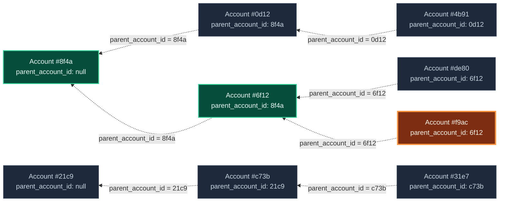

# GraphQL Auth Explosion Case Study, Part 5: Smart API's

Series: [GraphQL Auth Explosion Case Study](/articles/series/IAM-System-Demo/iam-system-demo)  
Overview: [GraphQL Auth Explosion Case Study](/articles/series/IAM-System-Demo/graphql-auth-explosion-case-study)

> Status: ramblings

## Smart API's

The account hierarchy is a tree, but each row only knows its immediate parent through `parent_account_id`. For a deeply nested account, the useful authorization question is often: which ancestors do I need to check before I can answer `can?`?

It is very common in this system to need to get the list of parent accounts for a given account because of the way Authorization works.

In order to satisfy this request in the uncached case, Account service must ask Organization service for the account id's that are in the organization. OrganizatonService will cache these account_id's in it's own Redis server. These account id's are then fed into the CTE query, and just the accounts that are direct ancestors of the requested account are returned. This list is also cached in Redis, but in AccountService's version.

Previous: [Part 4: Redis Cache, per service](/articles/series/IAM-System-Demo/graphql-auth-explosion-part-4-redis-cache-per-service)  
Next: [Part 6: Async MADNESS](/articles/series/IAM-System-Demo/graphql-auth-explosion-part-6-async-madness)

