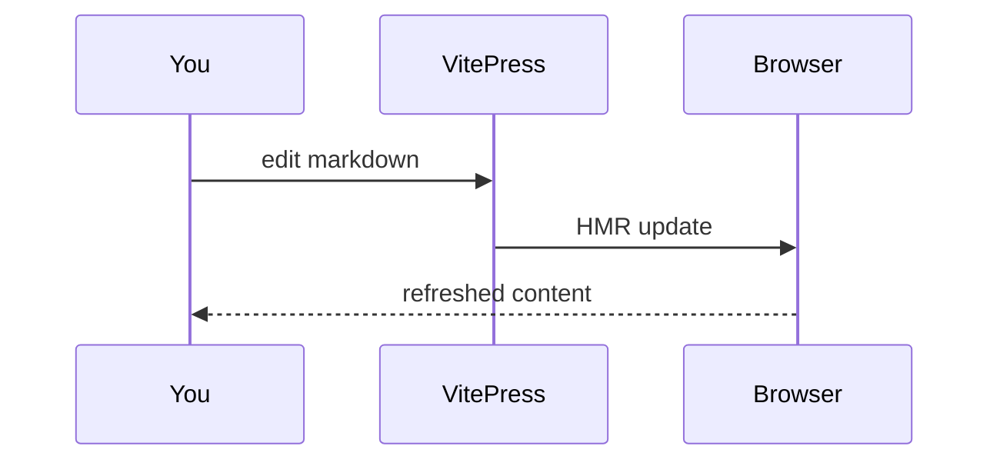

# Getting Started

Run the local docs server:

```bash
npm install
npm run docs:dev
```

Create a new post by adding a markdown file under `docs/` and linking it from the sidebar.


```mermaid
sequenceDiagram
  participant You
  participant VitePress
  participant Browser

  You->>VitePress: edit markdown
  VitePress->>Browser: HMR update
  Browser-->>You: refreshed content
```
