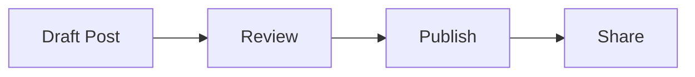

## Mermaid preview


```mermaid
flowchart LR
  A[Draft Post] --> B[Review]
  B --> C[Publish]
  C --> D[Share]
```

## Code highlighting preview

```ts
export function publishPost(title: string): string {
  return `Published: ${title}`
}
```
