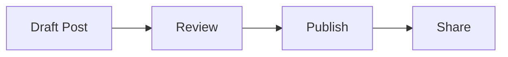

## Article drafts

- [How I Scaffolded an Entire Distributed Platform in 10 Minutes](/articles/series/IAM-System-Demo/distributed-platform-in-10-minutes)
- [GraphQL Auth Explosion Case Study](/articles/series/IAM-System-Demo/graphql-auth-explosion-case-study)
- [Finer Points of Exception Handling](/articles/finer-points-exception-handling)

## Mermaid preview



## Code highlighting preview

```ts
export function publishPost(title: string): string {
  return `Published: ${title}`
}
```
