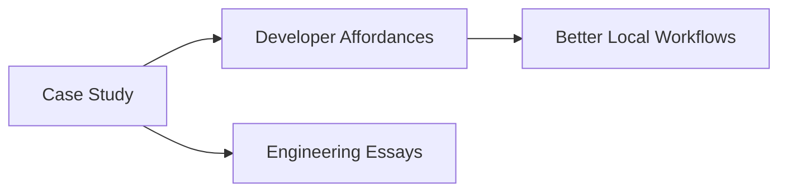

## Start Here

- [GraphQL Auth Explosion Case Study](/articles/series/IAM-System-Demo/iam-system-demo)
- [Developer Affordances](/articles/#developer-affordances)
- [Finer Points of Exception Handling](/articles/finer-points-exception-handling)

## Diagram Preview



## Code Highlighting Preview

```ts
export function publishPost(title: string): string {
  return `Published: ${title}`
}
```
